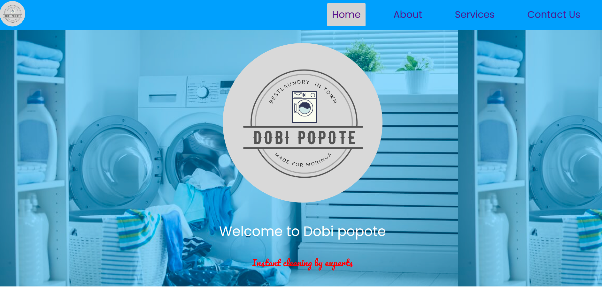
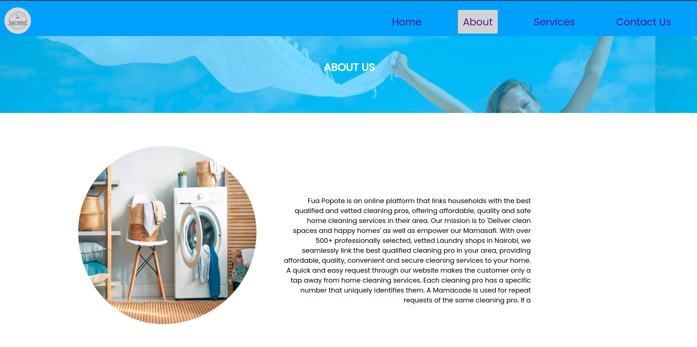
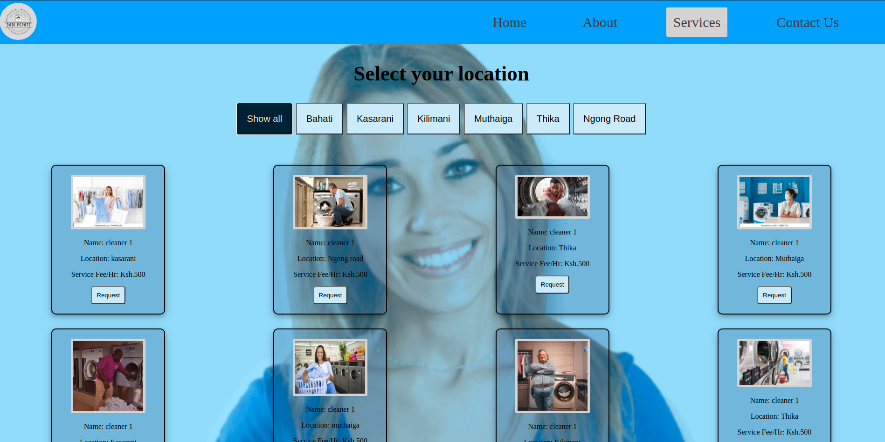
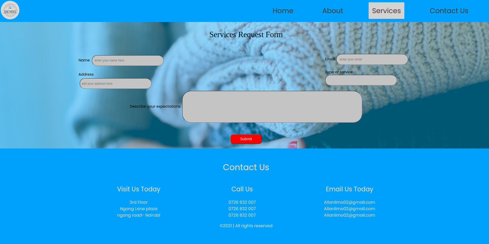
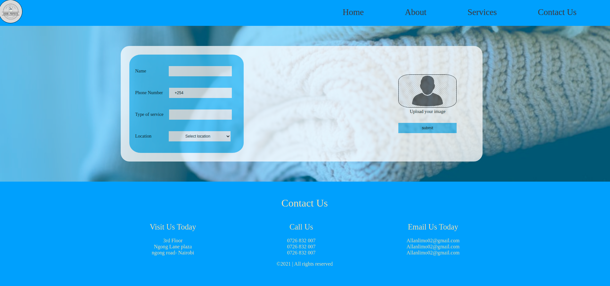
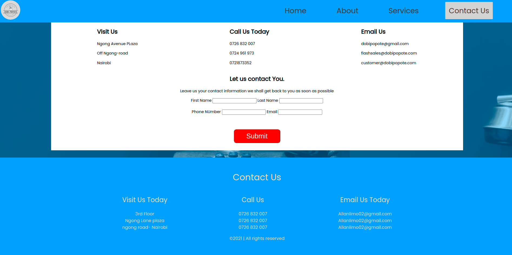

# Dobi popote
#### It is a six page website for requesting laundry services online
#### Created By Daniel Mutua, Allan Limo, Kinoti Gitonga and Francis Nguithu on 23-06-2021
## Description
This was week four group project, whereby we saw a propblem and created a solution website to help customers access laundry services easily. You can understand more by visiting the website.
## Setup/Installation Requirements
* Git
* Web-browser or your choice
* Github
## Technologies Used
 The following languages have been used on this project:
 * HTML
 * CSS
 * JAVASCRIPT

## Setup/Installation Requirements

* Live link to view the project <a href="#">View Anitas Kitchen</a>
## Some Screenshots

## Known Bugs
 So far so good there are no bugs related to this project 😎
## Support and contact details 🙂
To make a contribution to the code used or any suggestions you can click on the contact link and email us your suggestions.
* Email: isaiah.gitonga@student.moringaschool.com
* Phone: +254710120950
## License
* MIT licence Copyright (c) 2021 Moringa school.